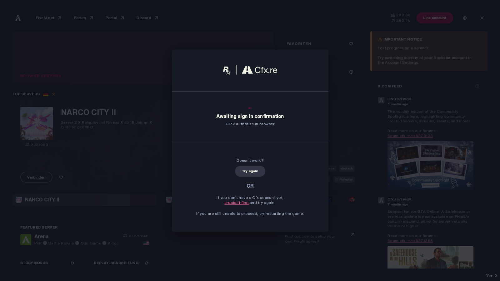
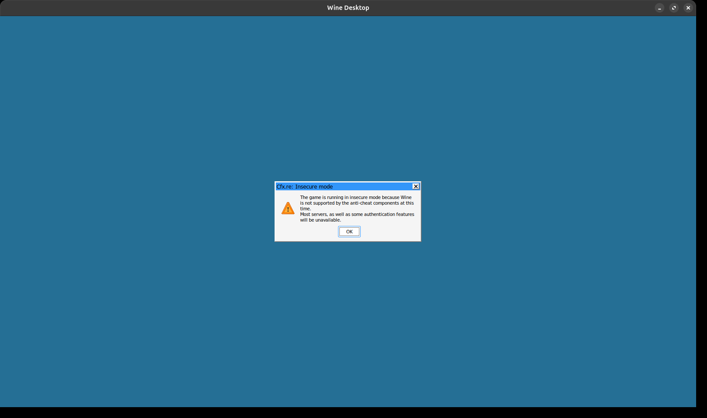
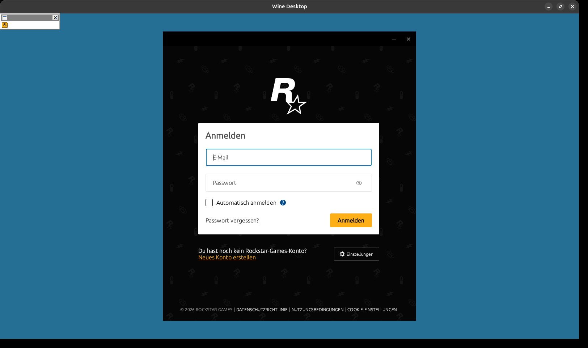
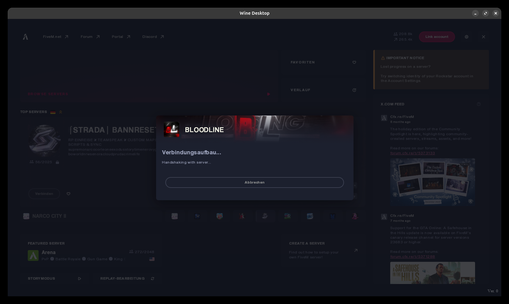

# FiveM nativ auf Linux 🐧

**FiveM (GTA V Multiplayer) auf Ubuntu/Linux zum Laufen bringen — komplett, Schritt für Schritt.**

Kein Dual-Boot, keine VM. Der FiveM-Client wird selbst kompiliert (in der GitHub-Cloud, keine Windows-Installation nötig) und läuft über **GE-Proton** direkt auf Linux — Hauptmenü, Rockstar-Login und GTA-V-Engine funktionieren.


*Das FiveM-Hauptmenü mit Live-Serverliste — nativ auf Ubuntu.*

> ### ⚠️ Status (aktiv in Arbeit)
> **Funktioniert:** Cloud-Build · Start unter GE-Proton · **Hauptmenü** · **Rockstar-/Social-Club-Login** (auto über Steam oder manuell) · GTA-V-Engine lädt · Server-**Handshake wird erreicht**.
> **Noch offen (untersucht):** Der Server-**Beitritt hängt beim Handshake**. Eingegrenzt auf ein **Wine-/Netzwerk-Problem im Client**, NICHT am Server: die TCP-Verbindung baut sauber auf, aber das ~264-Byte-Handshake-**Datenpaket wird vom Server nie ge-ACKt** (`ss` Send-Q bleibt bei 264). Beweis, dass der Server ok ist: ein **nativer** `curl -X POST …/client` liefert **HTTP 200**. Kein Steam-/Anti-Cheat-/Build-Versions-Problem. Nächste Ansätze: FiveM ohne umu-Container / anderes Proton starten, Paket-Byte-Vergleich Wine↔nativ, anderes Netzwerk-Interface (MTU 1456 = Tunnel?). *(Ein Rebuild aus aktuellem `citizenfx/master` + Patches wurde gebaut, ist aber unter Wine instabil — der aktuelle Master braucht mehr als die 2 Wine-Patches; daher bleibt der stabile `Gogsi/fivem wine-win10`-Build empfohlen.)*
> **Grenzen (bleiben):** „Insecure Mode" → Server mit **Anti-Cheat** lehnen ab; Server mit **`sv_enforceSteamAuth true`** (Steam-Pflicht) sind von Linux aus **nicht** joinbar (der Client kann kein gültiges GTA-V-Steam-Ticket liefern — fundamentale Linux-Grenze, im Detail unten). Ziel: **eigener Server / Server ohne Steam-Zwang & ohne Anti-Cheat.**

---

## 🚀 Schnellstart (ein Befehl)

**Ein `git clone`, ein `./scripts/install.sh` — fertig.** Das Skript installiert **alles selbst**: erst die **System-Pakete** (via `apt`/`dnf`/`pacman`/`zypper`), dann GE-Proton & umu, kompiliert den Client in der GitHub-Cloud und richtet die komplette Linux-Laufzeit ein. Du **loggst dich nur selbst ein** (das kann kein Skript für dich): bei der **GitHub CLI** (`gh auth login`) für den Cloud-Build, und später im Spiel bei **Rockstar** & **Cfx.re**.

```bash
git clone https://github.com/seltonmt012/fivem-linux.git
cd fivem-linux
chmod +x scripts/*.sh

./scripts/install.sh   # installiert System-Pakete, baut den Client (~50 Min, Cloud) & richtet alles ein
```

Das Skript fragt dich, falls `gh` noch nicht eingeloggt ist, nach einem einmaligen `gh auth login` — danach einfach `./scripts/install.sh` erneut starten. Zum Schluss startest du mit `./scripts/launch.sh`.

> **Einzige Voraussetzung, die das Skript nicht abnehmen kann:** GTA V **Legacy** (nicht „Enhanced") installiert und **einmal via Steam gestartet** — dabei installiert GTA V den **Rockstar Games Launcher**, den der Installer übernimmt. Alles andere (Pakete, `gh`, GE-Proton, umu …) macht das Skript selbst.

### Was macht das Skript? (in Klartext)

1. **System-Pakete installieren.** Erkennt deine Distro und installiert mit `sudo` die nötigen Pakete: `git`, `curl`, `wget`, `python3`, `winetricks`, `xdotool`, `x11-utils`, `imagemagick`, `cabextract`, `p7zip`, `fuse` — plus die **GitHub CLI `gh`**. Auf Debian/Ubuntu wird zusätzlich die **32-bit-Architektur (i386)** für Wine/Proton aktiviert. (Überspringbar mit `SKIP_SYSTEM_DEPS=1`.)
2. **GitHub-Login prüfen.** Bist du nicht eingeloggt, sagt dir das Skript klar Bescheid (`gh auth login`) und bricht ab — danach einfach neu starten.
3. **Client in der Cloud bauen.** Forkt unseren fertigen Fork **[`seltonmt012/fivem`](https://github.com/seltonmt012/fivem)** (hat den Wine-Patch + Build-Workflow schon eingebaut), startet den Build auf einem Windows-Runner in **GitHub Actions** und wartet, bis er fertig ist (~50 Min). Kein lokales Windows nötig.
4. **Artefakt herunterladen.** Lädt den fertigen `fivem-five-release`-Build nach `~/FiveM/release/`.
5. **Laufzeit beschaffen.** Lädt **umu-launcher** und das neueste **GE-Proton** automatisch herunter.
6. **Pfade finden.** Sucht deine **GTA-V-Installation** und den **Steam-Proton-Prefix** automatisch (Steam-Bibliotheken, Flatpak, externe Laufwerke).
7. **Alles verdrahten.** Schreibt `CitizenFX.ini`, legt den **Wine-Prefix** an, **importiert Rockstar Games Launcher + Registry** aus deinem Steam-Prefix, aktiviert den **Wine-Virtual-Desktop**, installiert die **VC++-Runtime** und registriert den **`fivem://`-Handler**.

Lieber alles von Hand nachvollziehen? Die **ausführliche Schritt-für-Schritt-Anleitung** steht weiter unten (Teil A–E).

---

## ⚖️ Wichtig / Rechtliches (bitte lesen)

- Der FiveM-Client ist **quelloffen** (Cfx.re). Das **Weitergeben von selbst kompilierten Client-Binaries verstößt gegen die Cfx.re-TOS** — deshalb **kompiliert hier jeder seine eigene Version selbst** (genau das macht diese Anleitung). In diesem Repo sind **nur Skripte & Doku, keine Binaries**.
- Du brauchst ein **legitimes GTA V** (Steam/Epic/Rockstar) und einen **eigenen Rockstar-Games-Account** + **Cfx.re-Account**.
- Unter Wine läuft der Client im **„Insecure Mode"** — das Anti-Cheat (`adhesive`) funktioniert auf Wine nicht. Du kannst nur auf **Server ohne aktives Anti-Cheat** (z. B. deinen eigenen Server). Offiziell ist das **experimentell/unsupported**.

Getestet auf **Ubuntu 26.04**, GNOME/Wayland, NVIDIA GTX 1060. Sollte auf den meisten modernen Distros mit GE-Proton laufen.

---

## 🧩 Warum es früher nicht ging (und jetzt schon)

Der aktuelle FiveM-Bootstrapper nutzt einen **WinUI/XAML-Splash**, der unter Wine crasht (`Windows.UI.Xaml.Hosting.WindowsXamlManager` nicht implementiert). Der Community-Fork **[`Gogsi/fivem`](https://github.com/Gogsi/fivem/tree/wine-win10)** (Branch `wine-win10`) behebt das mit nur **4 Dateien**, alle über `CfxIsWine()` abgesichert:

| Datei | Änderung |
|---|---|
| `UpdaterUI.cpp` | Schaltet den XAML-Splash unter Wine ab (der alte Crash) |
| `NUIWindow.cpp` | Aktiviert DXVK-Shared-Textures unter Wine → CEF/Menü rendert |
| `DllGameComponent.Win32.cpp` | Überspringt Windows-Speicherlayout-Hack unter Wine |
| `SEHTableHandler.Win32.cpp` | Überspringt SEH-Hook unter Wine |

---

## ✅ Voraussetzungen

**Nur Punkt 1 musst du selbst erledigen — den Rest übernimmt `install.sh`:**

1. **GTA V — Legacy Edition** (nicht „Enhanced"!) installiert, **einmal via Steam gestartet** — dabei installiert GTA V den **Rockstar Games Launcher + Social Club** in seinen Proton-Prefix (den übernehmen wir). *(Kann kein Skript für dich tun.)*
2. Ein **GitHub-Account** (zum Kompilieren in der Cloud) — das Skript hilft beim Login (`gh auth login`).

Alles Weitere richtet der Installer automatisch ein:

- **System-Pakete** — `git`, `curl`, `wget`, `python3`, `winetricks`, `xdotool`, `x11-utils`, `imagemagick`, `cabextract`, `p7zip`, `fuse` sowie die [GitHub CLI `gh`](https://cli.github.com/). Erledigt **Schritt 0** ([`scripts/install-deps-system.sh`](scripts/install-deps-system.sh)) für `apt`/`dnf`/`pacman`/`zypper`, inkl. `i386`-Multiarch auf Debian/Ubuntu. Willst du die Pakete lieber selbst verwalten: `SKIP_SYSTEM_DEPS=1 ./scripts/install.sh`.
- **GE-Proton** (neuestes Release) → automatisch nach `~/.local/share/Steam/compatibilitytools.d/` geladen.
- **umu-launcher** → automatisch als self-contained Zipapp geladen.

---

## 📦 Teil A — Client kompilieren (GitHub Actions, ~50 Min)

Du baust den gepatchten Client **in der Cloud** auf einem Windows-Runner — kein lokales Windows nötig.

> **✅ Am einfachsten: nimm unseren fertigen Fork [`seltonmt012/fivem`](https://github.com/seltonmt012/fivem).**
> Der hat den **Wine-Linux-Patch** (Branch `wine-win10`, ist der Default-Branch) **und den fertigen Build-Workflow** schon eingebaut — du musst also **nicht** selbst `Gogsi/fivem` forken, keinen Branch anlegen und keinen Workflow hochladen. Einfach forken und bauen:

1. **Forke** [`seltonmt012/fivem`](https://github.com/seltonmt012/fivem) in deinen GitHub-Account (du bekommst `wine-win10` automatisch als Default-Branch, inkl. Workflow).
2. Im Fork **Actions aktivieren** (Tab „Actions" → „I understand… enable"). Der Workflow ist **fork-unabhängig** — er baut automatisch dein eigenes Repo/deinen Branch.
3. Build starten: Actions → „build-linux-client" → „Run workflow" → Branch `wine-win10`.
4. Nach ~50 Min: Artefakt **`fivem-five-release`** herunterladen und nach z. B. `~/FiveM/release/` **entpacken**.

*(Oder komplett automatisch: `./scripts/install.sh` macht genau das — forkt `seltonmt012/fivem`, startet den Build, wartet und lädt das Artefakt.)*

<details><summary>Selber von <code>Gogsi/fivem</code> forken? Die 6 Build-Hürden, die der Workflow löst</summary>
- `runs-on: windows-2022` — **nicht** `windows-latest`! Das hat inzwischen VS 2026, das FiveMs altes node-gyp nicht kennt (`ffi-napi`-Fehler).
- `ilammy/msvc-dev-cmd` statt hardcodiertem VS-Pfad (setzt `VSINSTALLDIR` für node-gyp) + `GYP_MSVS_VERSION=2022`.
- MSBuild mit `-p:WindowsTargetPlatformVersion=10.0.22621.0` (Runner hat nicht die gepinnte 22000).
- Extra-Schritt: `run_postbuild.ps1` mit `env: CI: ''` ausführen — sonst fehlen **components.json, citizen/ui.zip, CEF (`bin/`), citizen/ros, data/** im Artefakt.
</details>

---

## ⚙️ Teil B — Linux-Setup (automatisch)

Alle Laufzeit-Schritte macht [`scripts/setup.sh`](scripts/setup.sh). **Oben im Skript die 5 Pfade anpassen** (RELEASE_DIR, GTA_DIR, STEAM_GTAV_PREFIX, PROTONPATH, VDESK_RES), dann:

```bash
chmod +x scripts/*.sh
RELEASE_DIR=~/FiveM/release ./scripts/setup.sh
```

Das erledigt: umu-launcher laden · `CitizenFX.ini` schreiben · Wine-Prefix anlegen · **Rockstar Games Launcher + Registry aus deinem Steam-GTA-V-Prefix importieren** · **Wine-Virtual-Desktop** aktivieren (Fenster sichtbar) · **VC++-Runtime installieren** (Pflicht!) · **`fivem://`-Handler** registrieren.

<details><summary>Was genau (manuell nachvollziehbar)</summary>

- **`CitizenFX.ini`** neben `FiveM.exe`: `[Game]` / `IVPath=Z:\pfad\zu\Grand Theft Auto V`
- **Rockstar Games Launcher**: FiveM braucht ihn unter `C:\Program Files\Rockstar Games\Launcher\Launcher.exe`. Wir kopieren `Program Files/Rockstar Games`, `Program Files (x86)/Rockstar Games`, `ProgramData/Rockstar Games`, `AppData/Local/Rockstar Games` aus `…/compatdata/271590/pfx` und mergen die `Rockstar`-Registry-Sektionen aus dessen `system.reg`/`user.reg`.
- **Virtual Desktop** (`user.reg`): `[Software\\Wine\\Explorer] "Desktop"="Default"` + `[…\\Desktops] "Default"="1600x900"` — ohne das sind Wine-Dialoge & das Rockstar-Login **unsichtbar**.
- **VC++-Runtime**: `winetricks -q vcrun2022 vcrun2019 d3dcompiler_47 corefonts` — **ohne die crasht der GTA5-GameProcess sofort.**
</details>

---

## ▶️ Teil C — Starten & Anmelden

```bash
RELEASE_DIR=~/FiveM/release ./scripts/launch.sh
```

- **Erststart** lädt ~2 GB Spieldaten-Cache. Die Box **„Cfx.re: Insecure mode"** mit **OK/Enter** bestätigen.

  

- **Rockstar-Login:** Ist **Steam offen und eingeloggt**, meldet sich der Rockstar Launcher **automatisch über deinen Steam-Account** an (GTA V ist Steam-Besitz). Sonst meldest du dich **einmal manuell** im Rockstar-Fenster an (Haken „Automatisch anmelden") — die Session bleibt dann gespeichert.

  

> **Warum Steam für den Auto-Login?** GTA V gehört deinem Steam-Account. Der Rockstar Launcher holt sich das „Entitlement" (Besitznachweis) über den laufenden Steam-Client → kein Passwort nötig. Ist Steam zu, geht der manuelle Rockstar-Login.

> **Hinweis „Ver. 0":** Unten rechts im FiveM-Fenster steht als Version „Ver. 0". Das ist **rein kosmetisch** und **kein Fehler** — der selbst gebaute Dev-Build hat keine eingebettete Versionsnummer (die setzt sonst die offizielle Cfx.re-Release-CI). Funktionalität ist davon nicht betroffen.

---

## 🔗 Teil D — Cfx.re-Account & `fivem://`-Handler

Im Menü kommt **„Cfx.re — Awaiting sign in confirmation — Click authorize in browser"**. FiveM verlangt einen **Cfx.re-Account** (Forum-Account) als deine **feste Identität** — Server erkennen dich daran (Bans, Whitelist, Rollen). Das ist normal, nicht Linux-spezifisch.

Nach dem Autorisieren im Browser leitet dieser auf `fivem://accept-auth/…` weiter. Damit Linux das an FiveM übergibt, registriert `setup.sh` einen **`fivem://`-Protokoll-Handler** ([`scripts/fivem-url-handler.sh`](scripts/fivem-url-handler.sh) + [`config/fivem-url.desktop`](config/fivem-url.desktop)). Ohne den sagt der Browser „Keine Anwendung verfügbar". Der Handler wird **auch zum Server-Beitritt** gebraucht (der „Connect"-Button nutzt `fivem://connect/…`).



---

## 🎮 Teil E — Spielen & Game-Build-Wechsel

Viele Server verlangen einen bestimmten **GTA-Build** (z. B. `b3570`). FiveM lädt/patcht den dann und **muss sich neu starten**. Auf Windows macht FiveM das selbst; unter umu wird der Neustart-Prozess aber vom Container gekillt.

**Lösung:** [`scripts/launch.sh`](scripts/launch.sh) ist ein **Relaunch-Loop** — er fängt FiveMs `-switchcl:… "fivem://connect/<server>"`-Neustart ab und startet automatisch wieder in den neuen Build + verbindet erneut. Du musst nichts manuell tun.

---

## 🛠️ Troubleshooting

| Problem | Lösung |
|---|---|
| GameProcess startet & schließt sofort | **VC++-Runtime fehlt** → `winetricks -q vcrun2022 vcrun2019` |
| „Rockstar Games Launcher could not be found" | RGL aus dem Steam-Prefix importieren (Teil B) |
| Rockstar-Login/Insecure-Box **unsichtbar** | Wine-**Virtual Desktop** aktivieren (Teil B) |
| `FatalError: Unknown component adhesive` | `adhesive` **nicht** aus `components.json` entfernen — Wine ersetzt es durch `sticky` |
| Browser: „Keine Anwendung verfügbar" bei Auth | `fivem://`-Handler registrieren (Teil D) |
| Build-Switch startet nicht neu | den Loop-`launch.sh` benutzen (Teil E) |
| Absturz debuggen | `WINEDEBUG=+seh,+tid PROTON_LOG=1 ./launch.sh` → `~/steam-fivem.log` |
| Schriftart sieht falsch aus | `winetricks -q corefonts` (Web-Fonts der UI fallen sonst zurück) |

---

## 🙏 Credits

- **[Gogsi](https://github.com/Gogsi/fivem/tree/wine-win10)** — der 4-Datei-Wine-Patch, ohne den nichts davon ginge.
- **Cfx.re / FiveM** — der quelloffene Client.
- **[umu-launcher](https://github.com/Open-Wine-Components/umu-launcher)** & **[GE-Proton](https://github.com/GloriousEggroll/proton-ge-custom)**.

*Diese Anleitung dokumentiert einen realen, funktionierenden Aufbau. „Results may vary" — Wine/Proton-Versionen ändern sich. PRs & Ergänzungen willkommen.*
